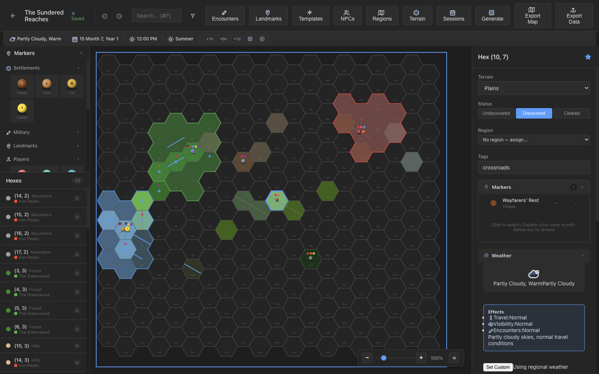

# Hexal

[](https://opensource.org/licenses/MIT)
[](https://github.com/ringo380/hexal/releases)
[](https://ringo380.github.io/hexal/)

A cross-platform desktop application for managing D&D hex crawl campaigns, built with Electron, React, and TypeScript.



## Features

- **Hex Grid Editor**: Visual hex grid with 10 customizable terrain types, LOD zoom, and smooth pan/zoom navigation
- **Campaign Management**: Create, save, load, and export campaigns with autosave (2s debounce)
- **Content Tracking**: Track locations, encounters, NPCs, treasures, and clues per hex with resolve tracking
- **Encounter System**: Full encounter editor with creature rosters, rewards, difficulty ratings, outcomes, and reusable templates
- **NPC Directory**: Track NPCs with race, class, alignment, attitude, faction membership, and inter-NPC relationships
- **Region Manager**: Define named geographic regions with color-coded borders, hex assignments, and discovery status
- **Procedural Generation**: Generate terrain, encounters, and landmarks with configurable density sliders and seeded PRNG
- **Time & Weather**: In-game calendar system with seasonal weather simulation and travel modifiers
- **Player View**: Second window with fog-of-war filtering, safe to project for players
- **Session Log**: Timeline-based session logging with tags, in-game timestamps, and per-hex event tracking
- **Tabletop Markers**: Draggable figurine-style markers for settlements, dungeons, players, and custom tokens
- **Rivers & Roads**: Hex-edge connections for rivers and roads that render on the grid
- **Terrain Editor**: Customize terrain types with colors, icons, move costs, and elevation
- **Command Palette**: Quick navigation with Cmd+K to jump to any hex, region, or NPC
- **Map Export**: Export maps to PNG, JPEG, or PDF with print-ready and player handout presets
- **Export Options**: Export campaign data to JSON or Markdown formats
- **Factions**: Define factions with goals, headquarters, alignment, and NPC membership
- **Undo/Redo**: Full 50-state history for all edits
- **Multi-Window Support**: Open multiple campaigns simultaneously

## Installation

Download the latest release from the [Releases page](https://github.com/ringo380/hexal/releases).

### macOS
- Download the `.dmg` file
- Open and drag Hexal to Applications
- Available for both Intel (x64) and Apple Silicon (arm64)

## Documentation

Visit the [Hexal documentation site](https://ringo380.github.io/hexal/) for feature screenshots and a getting-started guide.

## Development

```bash
# Install dependencies
npm install

# Start development server
npm run dev

# Build for production
npm run build

# Build macOS only
npm run build:mac

# Capture documentation screenshots (requires dev server running)
npm run screenshots
```

## Tech Stack

- **Frontend**: React 18, TypeScript
- **Desktop**: Electron 35
- **Build**: Vite, electron-builder
- **State Management**: React Context + useReducer
- **Rendering**: HTML5 Canvas

## Project Structure

```
hexal/
├── electron/           # Electron main process
│   ├── main.ts        # Main process entry point
│   └── preload.ts     # Preload script for IPC
├── src/
│   ├── components/    # React components
│   ├── stores/        # State management contexts
│   ├── services/      # Utility services (hex geometry, time, weather)
│   ├── styles/        # CSS styles
│   ├── types/         # TypeScript type definitions
│   └── data/          # Static data (calendars, weather effects)
├── docs/              # GitHub Pages site and screenshots
├── e2e/               # End-to-end tests and screenshot capture
├── index.html
├── package.json
├── tsconfig.json
└── vite.config.ts
```

## Contributing

Contributions are welcome! Please see [CONTRIBUTING.md](CONTRIBUTING.md) for guidelines.

## License

This project is licensed under the MIT License - see the [LICENSE](LICENSE) file for details.
